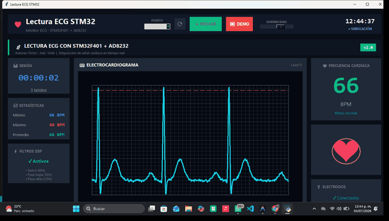

# 🏥 Lectura con Monitor ECG 

**CardioView Pro** es un sistema avanzado de monitoreo electrocardiográfico (ECG) en tiempo real, desarrollado sobre la plataforma STM32 y con una interfaz de visualización médica profesional en Python.


<div align="center">
  
  
  
  
  
  
  
</div>

## 📋 Descripción

Este proyecto implementa un monitor cardíaco completo que adquiere señales biopotenciales utilizando el sensor AD8232 y un microcontrolador STM32F401. El firmware realiza un pre-procesamiento digital de la señal (DSP) para eliminar ruido, mientras que la aplicación de escritorio proporciona una visualización nítida, cálculo de frecuencia cardíaca (BPM) y análisis en tiempo real.

<div align="center">
  
</div>

### ✨ Características Principales

*   **Adquisición de Precisión:** Muestreo a 250Hz con ADC de 12-bits.
*   **Procesamiento Digital de Señales (DSP) Embebido:**
    *   Filtro Notch de 60Hz (elimina ruido de línea eléctrica).
    *   Filtro Pasa-Bajas de 35Hz (suavizado).
    *   Filtro Pasa-Altas de 0.5Hz (elimina deriva DC).
*   **Interfaz Médica "Dark Mode":** Diseñada con `tkinter` para reducir fatiga visual y resaltar datos críticos.
*   **Detección de Anomalías:** Indicadores visuales para desconexión de electrodos (Leads Off).
*   **Métricas en Vivo:** Cálculo instantáneo de BPM, promedios y calidad de señal.

## 🛠️ Tecnologías Utilizadas

### Hardware
*   **MCU:** STM32F401RETx (Nucleo-64)
*   **Sensor:** Módulo AD8232 (Single Lead Heart Rate Monitor)
*   **Conexión:** UART/Serial a USB

### Firmware (C / STM32CubeIDE)
*   Implementación de filtros IIR (Butterworth 2do orden).
*   Manejo eficiente de interrupciones y ADC.

### Software (Python 3)
*   **Tkinter:** Interfaz gráfica.
*   **SciPy / NumPy:** Procesamiento secundario de señales.
*   **Pyserial:** Comunicación UART.

## 🚀 Instalación y Uso

### 1. Firmware (STM32)
1.  Abrir el proyecto en **STM32CubeIDE**.
2.  Compilar y cargar el código en la tarjeta STM32F401.
3.  Conectar el sensor AD8232 a los pines configurados:
    *   **Output:** PA0 (A0)
    *   **LO+:** PA1
    *   **LO-:** PA4

### 2. Software (PC)
1.  Asegúrate de tener Python instalado.
2.  Instala las dependencias:
    ```bash
    pip install -r requirements.txt
    ```
    *(Si no existe `requirements.txt`, necesitas: `pyserial`, `numpy`, `scipy`)*
3.  Ejecuta la interfaz:
    ```bash
    python ecg_monitor_v2.py
    ```
4.  Selecciona el puerto COM de tu STM32 y presiona **INICIAR**.

## 👥 Autores

*   **Victor**
*   **Joel**
*   **Uriel**

---
*Desarrollado para propósitos educativos y de demostración técnica.*
